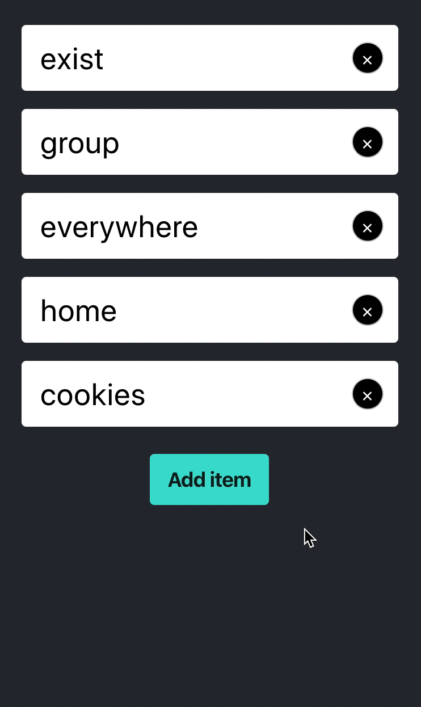

After over 5 years writing React components almost every single day, I have identified logic as being the number one source of bugs. By "logic", I mean all the JavaScript code you need to write to select and modify data in your components.

Sometimes it's not the logic itself that contains bugs. It's how you organize it that increases your chances to introduce bugs.

In this post, I will guide you through how I would approach the implementation of a list where you can add, update and delete items.

---

### Result



This is the app we are building. I will skip the layout part as it's off topic.

### List data

I'm using [random-words](https://www.npmjs.com/package/random-words) to generate the values of the list and [uuid](https://www.npmjs.com/package/uuid) to generate the unique `id`s. Both wrapped in a function, it looks like this:

```jsx
import uuid from "uuid/v4";
import getRandomWords from "random-words";

export function getListData() {
  const randomWords = getRandomWords(5);
  const listData = randomWords.map(randomWord => {
    return {
      id: uuid(),
      value: randomWord
    };
  });
  return listData;
}
```

Then, I load them in the list component on mount like you would do in a normal fetch:

```jsx
import React from "react";

import { getListData } from "./AmazingList.utils";

const AmazingList = () => {
  const [list, setList] = React.useState([]);

  React.useEffect(() => {
    setList(getListData());
  }, [])

  const addItem = () => {}
  const updateItem = () => {}
  const removeItem = () => {}

  return (
    ...
  )
}
```

I'm not using an `async` function, but you get an idea. Let's implement the functions below the mount effect.

### Remove

The `remove` function is about removing an item from the list. For sake of simplicity, let's say we receive the item's `id` as an argument:

```jsx
const removeItem = itemId => {
  setList(list => {
    const matchIsNotItemToDelete = item => item.id !== itemId;
    const updatedList = list.filter(matchIsNotItemToDelete);
    return updatedList;
  });
};
```

Filter the list keeping the items that don't have the `id` we want to remove. Works, right ? Let's move to the next one.

### Add

The `add` function is about adding a new item at the end of the list. At the time where the user presses "Add item", we don't have data to add to the list, so we will generate another random value and add it to the list. First a small helper:

```jsx
import getRandomWords from "random-words";

export function getRandomWord() {
  return getRandomWords(1)[0];
}
```

And the function:

```jsx
const addItem = () => {
  setList(list => {
    const newItem = { id: uuid(), value: getRandomWord() };
    return [...list, newItem];
  });
};
```

First, we generate the new item with our libraries. Then, we spread the list to return a different array that triggers a rerender and add the item to the end. Works, right ? Let's move to the next one.

### Update

The `update` function is about updating the `value` property of an item from the list. The update trigger will come from an `onChange` event of one of the inputs, so I have decided to assign the `item.id` as the `name` attribute of each input to be able to recognize which item we need to update:

```jsx
const updateItem = event => {
  const { name, value } = event.target;

  const itemIdToUpdate = name;

  setList(list => {
    const matchIsItemToUpdate = item => item.id === itemIdToUpdate;
    const updatedList = list.map(listItem => {
      if (matchIsItemToUpdate(listItem)) {
        return { ...listItem, value };
      } else {
        return listItem;
      }
    });
    return updatedList;
  });
};
```

First, we grab the `name` and `value` from the event object. Then, similarly as when removing an item, we map the list overriding the value of the item to be updated and leaving the other items untouched.

### What now ?

It looks like our app is running, we could call it a day. However, look our component:

```jsx
import React from "react";
import uuid from "uuid/v4";

const AmazingList = () => {
  const [list, setList] = React.useState([]);

  React.useEffect(() => {
    setList(getListData());
  }, []);

  const addItem = () => {
    setList(list => {
      const newItem = { id: uuid(), value: getRandomWord() };
      return [...list, newItem];
    });
  };
  const updateItem = event => {
    const { name, value } = event.target;

    const itemIdToUpdate = name;

    setList(list => {
      const matchIsItemToUpdate = item => item.id === itemIdToUpdate;
      const updatedList = list.map(listItem => {
        if (matchIsItemToUpdate(listItem)) {
          return { ...listItem, value };
        } else {
          return listItem;
        }
      });
      return updatedList;
    });
  };
  const removeItem = itemId => {
    setList(list => {
      const matchIsNotItemToDelete = item => item.id !== itemId;
      const updatedList = list.filter(matchIsNotItemToDelete);
      return updatedList;
    });
  };

  return (
    ...
  );
};
```

We have already extracted the `random-words` logic out of the component, which reduces the amount of logic in it, but the question I asked myself many times at this point is:

Should a React component own the logic of how it's state is managed ?

Should it know that when creating a new item we are using `uuid` to generate a new `id` ? Should it know that we use `id` as a reference for finding elements in the list ?

In my opinion, it shouldn't. The ability to have inline JavaScript in our view doesn't always mean it's the right thing to do. I would much rather refactor the component to look like this:

```jsx
const AmazingList = () => {
  const [list, setList] = React.useState([]);

  React.useEffect(() => {
    setList(getListData());
  }, []);

  const addItem = () => {
    setList(list => addNewItemToList(list));
  };
  const updateItem = event => {
    const { name, value } = event.target;

    const itemIdToUpdate = name;

    setList(list => updateListItem(list, itemIdToUpdate, value));
  };
  const removeItem = itemId => {
    setList(list => removeListItem(list, itemId));
  };

  return (
    ...
  );
};
```

In this case, our component is only the glue that enables our data to live. When looking at the component, we can quickly go through all the events and actions it handles and understand without any noise what is the lifecycle of the data.

The logic moved to `AmazingList.utils.js` looks like this:

```jsx
import uuid from "uuid/v4";

function addNewItemToList(list) {
  const newItem = { id: uuid(), value: getRandomWord() };
  return [...list, newItem];
}

function updateListItem(list, itemIdToUpdate, value) {
  const matchIsItemToUpdate = item => item.id === itemIdToUpdate;
  const updatedList = list.map(listItem => {
    if (matchIsItemToUpdate(listItem)) {
      return { ...listItem, value };
    } else {
      return listItem;
    }
  });
  return updatedList;
}

function removeListItem(list, itemIdToDelete) {
  const matchIsNotItemToDelete = item => item.id !== itemIdToDelete;
  const updatedList = list.filter(matchIsNotItemToDelete);
  return updatedList;
}
```

We are using [pure functions](https://en.wikipedia.org/wiki/Pure_function) to manipulate the data. If you look closely, the body of the functions is the same as before. What are the benefits then ?

From my point of view, it's like black and white:

- There is less noise when reading your React component from top to bottom. That facilitates building your mental model of how the component works and makes it straightforward to know where to dig into when you want to extend or refactor some part of it.

- Your data manipulation functions are now pure functions. As they don't depend on a context, it's straightforward to test them ([TDD](https://en.wikipedia.org/wiki/Test-driven_development)) and you can share them with other components that might not even be React ones.

---

### Closing words

Readability concerns me a lot. The same logic can be written in many ways, and it has an impact on the amount of effort needed to understand it afterwards.

When writing React components, I believe skimming through the component should be enough to understand it. To reach that goal, I think it's fundamental to remove all the noise around the logic your component is in charge off. This could mean to extract data manipulation logic as we just did or to split your component by concerns.

It's certainly not enough to catch bugs -- specially the UI interaction ones (you should [test your components](https://testing-library.com/docs/react-testing-library/intro)) -- but you are keeping your room clean and tidy. You are [falling into the pit of success](https://blog.codinghorror.com/falling-into-the-pit-of-success/).

